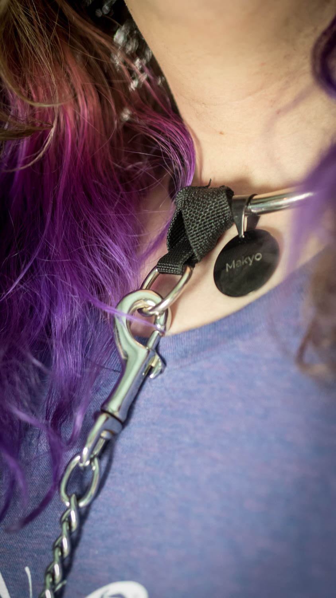

# BDSM Collar Leash/Tag Attachment

Inspired out of a need for a way to attach a leash to a metal collar without scratching the the collar itself, this attachment provides a D-ring for a leash or a tag.

When we got our new Eternity Collars, we were happy, then stymied as to how to attach a leash without scratching the brand new buffed titanium band. After putting some thought into it, we came up with this attachment. It simply slips behind the band and then loops through itself instantly adding a D-ring to the collar. The nylon webbing will not scratch or mar the collar, and can be added or removed with ease. Additionally, this attachment will work on many larger D-rings, which will allow the wearer to quickly attach, detach, or swap tags as the situation requires. Headed out and don't want to be jingling? Just remove the attachment and you can keep the tag in your pocket and still wear your fashionable collar!

[Available for purchase](www.etsy.com/listing/474973252/leash-and-tag-attachment-for-bdsm)

